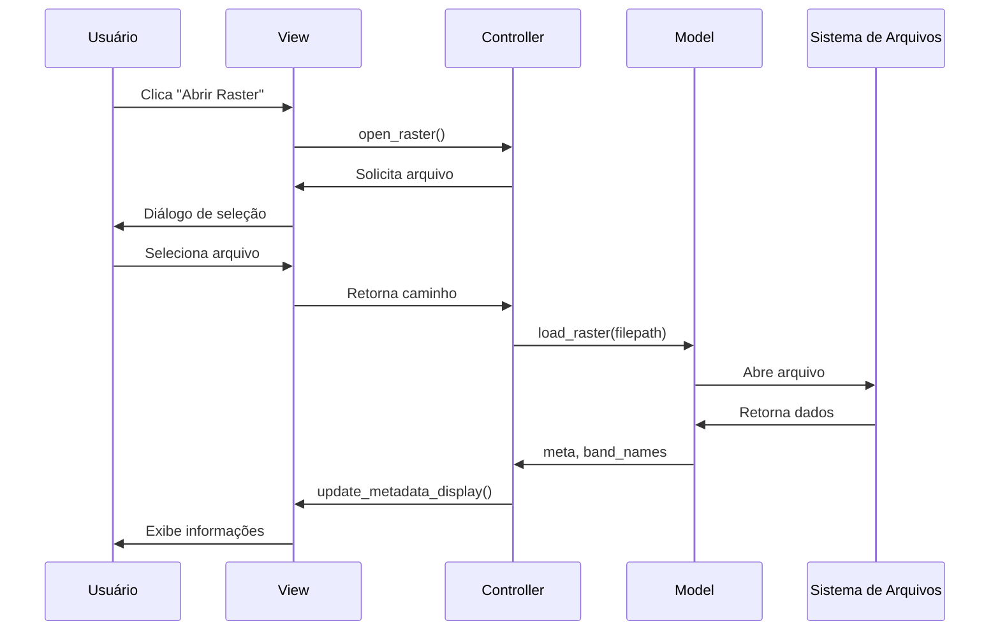
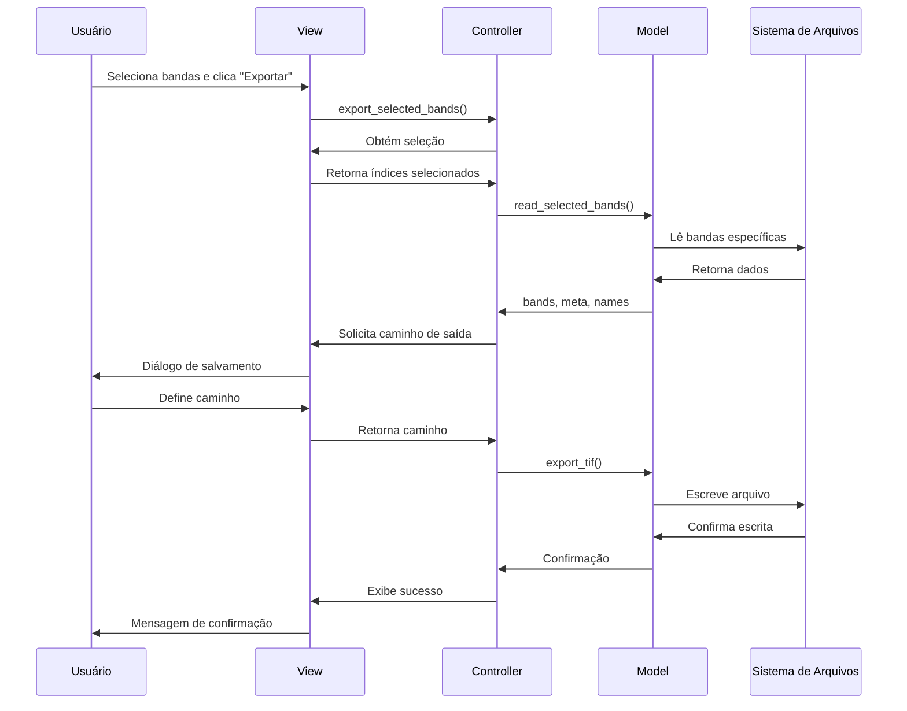

# Arquitetura do Sistema - IGCV Raster Utility

## Visão Geral da Arquitetura

O IGCV Raster Utility foi projetado seguindo princípios de arquitetura limpa, com separação clara de responsabilidades e alta coesão entre módulos relacionados. A arquitetura baseia-se no padrão MVC (Model-View-Controller) com extensões para suportar tanto interface gráfica quanto linha de comando.

## Diagrama de Arquitetura

```
┌──────────────────────────────────────────────────────────────────┐
│                        APLICAÇÃO                                 │
├──────────────────────────────────────────────────────────────────┤
│                                                                  │
│  ┌─────────────┐    ┌───────────────┐    ┌──────────────┐        │
│  │    VIEW     │    │   CONTROLLER  │    │    MODEL     │        │
│  │             │    │               │    │              │        │
│  │ main_window │◄──►│main_controller│◄──►│raster_handler│        │
│  │             │    │               │    │              │        │
│  └─────────────┘    └───────────────┘    └──────────────┘        │
│         │                   │                   │                │
│         │                   │                   │                │
│  ┌─────────────┐    ┌─────────────┐      ┌─────────────┐         │
│  │     CLI     │    │ EXCEPTIONS  │      │   LOGGER    │         │
│  │             │    │             │      │             │         │
│  │  cli_app    │    │ exceptions  │      │   logger    │         │
│  │             │    │             │      │             │         │
│  └─────────────┘    └─────────────┘      └─────────────┘         │
│                                                                  │
├──────────────────────────────────────────────────────────────────┤
│                    INFRAESTRUTURA                                │
├──────────────────────────────────────────────────────────────────┤
│  ┌─────────────┐    ┌─────────────┐      ┌─────────────┐         │
│  │   PyQt5     │    │  rasterio   │      │   numpy     │         │
│  │             │    │             │      │             │         │
│  │   GUI       │    │   Raster    │      │   Arrays    │         │
│  │ Framework   │    │ Processing  │      │   Math      │         │
│  └─────────────┘    └─────────────┘      └─────────────┘         │
└──────────────────────────────────────────────────────────────────┘
```

## Camadas da Arquitetura

### 1. Camada de Apresentação (Presentation Layer)

#### Interface Gráfica (GUI)
- **Componente**: `view/main_window.py`
- **Responsabilidades**:
  - Renderização da interface do usuário
  - Captura de eventos do usuário
  - Exibição de dados e feedback
  - Gerenciamento de traduções

#### Interface de Linha de Comando (CLI)
- **Componente**: `cli/cli_app.py`
- **Responsabilidades**:
  - Parsing de argumentos de linha de comando
  - Validação de parâmetros de entrada
  - Saída formatada para console
  - Processamento em lote

### 2. Camada de Controle (Control Layer)

#### Controller Principal
- **Componente**: `controller/main_controller.py`
- **Responsabilidades**:
  - Coordenação entre View e Model
  - Gerenciamento de estado da aplicação
  - Validação de regras de negócio
  - Tratamento de erros específicos da interface

### 3. Camada de Domínio (Domain Layer)

#### Model de Dados Raster
- **Componente**: `model/raster_handler.py`
- **Responsabilidades**:
  - Processamento de dados raster
  - Manipulação de metadados
  - Operações de I/O de arquivos
  - Algoritmos de processamento

### 4. Camada de Infraestrutura (Infrastructure Layer)

#### Sistema de Exceções
- **Componente**: `exceptions.py`
- **Responsabilidades**:
  - Definição de hierarquia de exceções
  - Categorização de tipos de erro
  - Facilitação de debugging

#### Sistema de Logging
- **Componente**: `logger.py`
- **Responsabilidades**:
  - Configuração de logging
  - Gerenciamento de arquivos de log
  - Formatação de mensagens
  - Controle de níveis de log

## Padrão MVC Detalhado

### Model (Modelo)

O Model representa a lógica de negócio e os dados da aplicação. No IGCV Raster Utility, o Model é responsável por:

```python
# Exemplo de uso do Model
class RasterHandler:
    def load_raster(filepath):
        """Carrega informações básicas do raster"""
        
    def read_selected_bands(filepath, indices):
        """Lê bandas específicas do arquivo"""
        
    def export_tif(out_path, bands, meta, ...):
        """Exporta dados para arquivo GeoTIFF"""
```

**Características do Model**:
- **Independência**: Não conhece View ou Controller
- **Reutilização**: Pode ser usado por GUI e CLI
- **Testabilidade**: Fácil de testar isoladamente
- **Encapsulamento**: Esconde complexidade do processamento

### View (Visão)

A View é responsável pela apresentação dos dados ao usuário. No projeto:

```python
# Exemplo de View
class MainWindow(QMainWindow):
    def __init__(self):
        # Configuração da interface
        self.setup_ui()
        
    def update_metadata_display(self, meta, band_names):
        """Atualiza exibição de metadados"""
        
    def update_preview_image(self, preview_array):
        """Atualiza preview da imagem"""
```

**Características da View**:
- **Passividade**: Não contém lógica de negócio
- **Observação**: Reage a mudanças no Model via Controller
- **Independência**: Pode ser substituída sem afetar outras camadas
- **Tradução**: Gerencia interface multilíngue

### Controller (Controlador)

O Controller coordena as interações entre Model e View:

```python
# Exemplo de Controller
class MainController:
    def __init__(self, view):
        self.view = view
        self.raster_path = None
        
    def open_raster(self):
        """Coordena abertura de arquivo raster"""
        # 1. Solicita arquivo via View
        # 2. Valida entrada
        # 3. Chama Model para processar
        # 4. Atualiza View com resultados
        
    def export_selected_bands(self):
        """Coordena exportação de bandas"""
        # 1. Obtém seleção da View
        # 2. Valida dados
        # 3. Processa via Model
        # 4. Atualiza View com feedback
```

**Características do Controller**:
- **Coordenação**: Orquestra fluxo de dados
- **Validação**: Aplica regras de negócio
- **Estado**: Mantém estado da aplicação
- **Tratamento de Erros**: Gerencia exceções da interface

## Fluxo de Dados

### Fluxo de Carregamento de Raster



### Fluxo de Exportação



## Princípios de Design Aplicados

### 1. Separação de Responsabilidades (SRP)
- Cada classe tem uma única responsabilidade
- Módulos são coesos e pouco acoplados
- Interfaces bem definidas entre camadas

### 2. Inversão de Dependência (DIP)
- Camadas superiores não dependem de implementações específicas
- Abstrações são definidas nas camadas superiores
- Dependências são injetadas via construtor

### 3. Aberto/Fechado (OCP)
- Extensível para novos formatos de arquivo
- Novos tipos de processamento podem ser adicionados
- Interface pode ser estendida sem modificar código existente

### 4. Substituição de Liskov (LSP)
- Implementações podem ser substituídas sem quebrar funcionalidade
- Interfaces são respeitadas por todas as implementações
- Comportamento é consistente entre implementações

## Estratégias de Tratamento de Erros

### Hierarquia de Exceções

```python
class IGCVRasterError(Exception):
    """Exceção base para todos os erros do projeto"""
    pass

class RasterHandlerError(IGCVRasterError):
    """Erros de processamento de dados raster"""
    pass

class ControllerError(IGCVRasterError):
    """Erros de lógica de negócio"""
    pass

class ViewError(IGCVRasterError):
    """Erros de interface gráfica"""
    pass

class CLIError(IGCVRasterError):
    """Erros de linha de comando"""
    pass
```

### Estratégias de Recuperação

1. **Validação Preventiva**
   - Verificação de arquivos antes do processamento
   - Validação de parâmetros de entrada
   - Verificação de permissões

2. **Recuperação Graceful**
   - Continuação da aplicação após erros não críticos
   - Feedback claro ao usuário
   - Logging detalhado para debugging

3. **Fallbacks Inteligentes**
   - Valores padrão para configurações ausentes
   - Processamento parcial quando possível
   - Degradação graciosa de funcionalidades

## Considerações de Performance

### Otimizações Implementadas

1. **Leitura Seletiva**
   - Apenas bandas necessárias são carregadas
   - Redução significativa de uso de memória
   - Processamento mais rápido

2. **Downsampling para Preview**
   - Redução de resolução para visualização
   - Performance melhorada na interface
   - Experiência do usuário otimizada

3. **Gerenciamento de Memória**
   - Liberação automática de recursos
   - Uso de context managers (with statements)
   - Evita vazamentos de memória

### Pontos de Atenção

1. **Tamanho de Arquivos**
   - Arquivos muito grandes podem consumir muita RAM
   - Processamento pode ser lento para datasets grandes
   - Necessidade de estratégias de chunking

2. **Concorrência**
   - Interface pode travar durante processamento pesado
   - Necessidade de threads para operações longas
   - Feedback de progresso para o usuário

## Extensibilidade

### Pontos de Extensão

1. **Novos Formatos de Arquivo**
   - Interface comum para diferentes formatos
   - Plugins para formatos específicos
   - Conversão automática entre formatos

2. **Novos Algoritmos de Processamento**
   - Interface para índices espectrais
   - Plugins para filtros e transformações
   - Pipeline de processamento configurável

3. **Novas Interfaces**
   - API REST para integração web
   - Biblioteca Python para uso programático
   - Integração com outros softwares GIS

### Padrões de Extensão

1. **Strategy Pattern**
   - Diferentes estratégias de processamento
   - Seleção dinâmica de algoritmos
   - Configuração flexível

2. **Factory Pattern**
   - Criação de objetos baseada em configuração
   - Suporte a múltiplos formatos
   - Extensibilidade sem modificação

3. **Observer Pattern**
   - Notificação de mudanças de estado
   - Atualização automática da interface
   - Desacoplamento entre componentes

## Conclusão

A arquitetura do IGCV Raster Utility foi projetada para ser:

- **Manutenível**: Código bem estruturado e documentado
- **Extensível**: Fácil adição de novas funcionalidades
- **Testável**: Componentes isolados e bem definidos
- **Robusta**: Tratamento abrangente de erros
- **Performática**: Otimizações para uso eficiente de recursos

Esta arquitetura fornece uma base sólida para o desenvolvimento futuro e manutenção do projeto, permitindo evolução contínua sem comprometer a estabilidade e qualidade do código. 