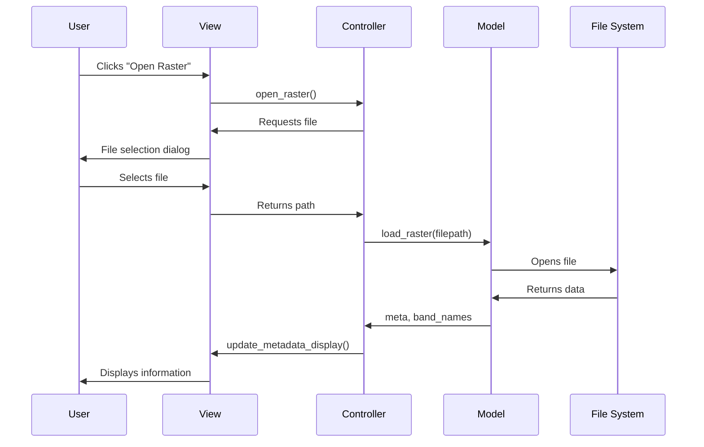
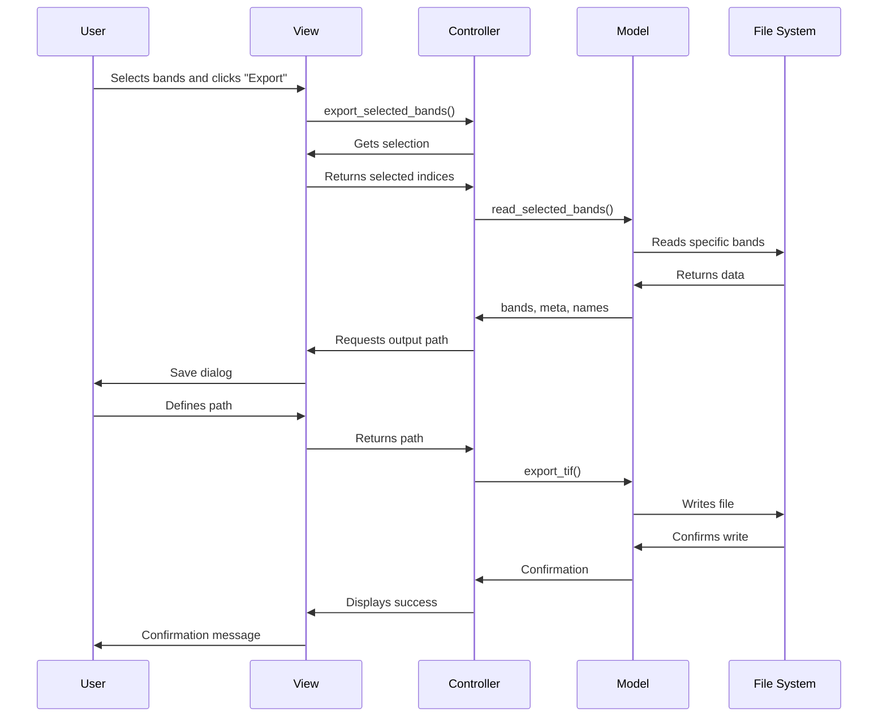
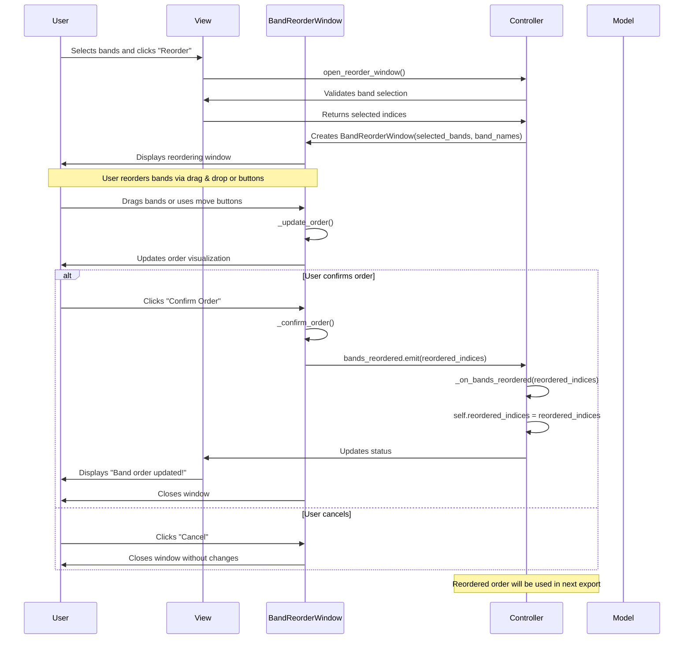
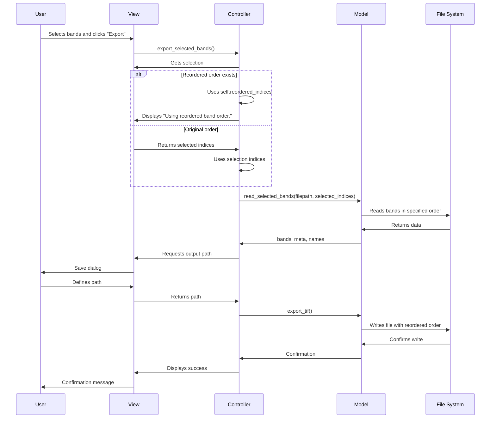

# System Architecture - IGCV Raster Utility

## Overview

The IGCV Raster Utility is built following the **Model-View-Controller (MVC)** architectural pattern, ensuring clean separation of concerns, maintainability, and extensibility. This document describes the system's architecture, design principles, and implementation details.

## Architectural Pattern

### MVC Implementation

The application follows the MVC pattern with clear separation between:

- **Model**: Data and business logic
- **View**: User interface and presentation
- **Controller**: Coordination and state management

```python
# MVC Structure Example
class RasterHandler:          # Model
    def load_raster(self): pass
    def process_bands(self): pass

class MainWindow:             # View
    def display_data(self): pass
    def get_user_input(self): pass

class MainController:         # Controller
    def coordinate_operation(self): pass
    def manage_state(self): pass
```

### Component Responsibilities

#### Model (Model)

The Model represents the business logic and application data. In IGCV Raster Utility, the Model is responsible for:

```python
# Model usage example
class RasterHandler:
    def load_raster(filepath):
        """Loads basic raster information"""
        
    def read_selected_bands(filepath, indices):
        """Reads specific bands from file"""
        
    def export_tif(out_path, bands, meta, ...):
        """Exports data to GeoTIFF file"""
```

**Model Characteristics**:
- **Independence**: Does not know about View or Controller
- **Reusability**: Can be used by GUI and CLI
- **Testability**: Easy to test in isolation
- **Encapsulation**: Hides processing complexity

#### View (View)

The View is responsible for presenting data to the user. In the project:

```python
# View example
class MainWindow(QMainWindow):
    def __init__(self):
        # Interface configuration
        self.setup_ui()
        
    def update_metadata_display(self, meta, band_names):
        """Updates metadata display"""
        
    def update_preview_image(self, preview_array):
        """Updates image preview"""
```

**View Characteristics**:
- **Passivity**: Contains no business logic
- **Observation**: Reacts to Model changes via Controller
- **Independence**: Can be replaced without affecting other layers
- **Translation**: Manages multilingual interface

#### Controller (Controller)

The Controller coordinates interactions between Model and View:

```python
# Controller example
class MainController:
    def __init__(self, view):
        self.view = view
        self.raster_path = None
        
    def open_raster(self):
        """Coordinates raster file opening"""
        # 1. Request file via View
        # 2. Validate input
        # 3. Call Model for processing
        # 4. Update View with results
        
    def export_selected_bands(self):
        """Coordinates band export"""
        # 1. Get selection from View
        # 2. Validate data
        # 3. Process via Model
        # 4. Update View with feedback
```

**Controller Characteristics**:
- **Coordination**: Orchestrates data flow
- **Validation**: Applies business rules
- **State**: Maintains application state
- **Error Handling**: Manages interface exceptions
- **Reordering Management**: Controls band order

### Band Reordering Component

The band reordering functionality is implemented as a specialized component that follows MVC principles:

```python
# Reordering Window (Specialized View)
class BandReorderWindow(QDialog):
    bands_reordered = pyqtSignal(list)  # Signal for communication
    
    def __init__(self, parent, selected_bands, band_names):
        # Reordering interface configuration
        
    def _confirm_order(self):
        """Confirms order and emits signal"""
        self.bands_reordered.emit(self.reordered_indices)
```

**Reordering Architecture**:
- **Specialized View**: `BandReorderWindow` - Dedicated interface for reordering
- **Signal Communication**: Uses Qt signal system for asynchronous communication
- **Persistent State**: Controller maintains reordered state until next export
- **Integrated Validation**: Verifies band selection before opening window
- **Visual Feedback**: Real-time order update of bands

**MVC Integration**:
- **View**: `BandReorderWindow` is an extension of the main View
- **Controller**: Manages reordering state and coordinates communication
- **Model**: Not affected - processes data in received order
- **Signals**: Allows decoupled communication between components

## Data Flow

### Raster Loading Flow



### Export Flow



### Band Reordering Flow



### Export Flow with Reordering



## Applied Design Principles

### 1. Single Responsibility Principle (SRP)
- Each class has a single responsibility
- Modules are cohesive and loosely coupled
- Well-defined interfaces between layers

### 2. Dependency Inversion Principle (DIP)
- Higher layers do not depend on specific implementations
- Abstractions are defined in higher layers
- Dependencies are injected via constructor

### 3. Open/Closed Principle (OCP)
- Extensible for new file formats
- New processing types can be added
- Interface can be extended without modifying existing code

### 4. Liskov Substitution Principle (LSP)
- Implementations can be substituted without breaking functionality
- Interfaces are respected by all implementations
- Behavior is consistent between implementations

### 5. Observer Pattern (For Reordering)
- Qt signal system for communication between components
- Decoupling between reordering window and controller
- Asynchronous notification of state changes

```python
# Observer pattern example for reordering
class BandReorderWindow(QDialog):
    bands_reordered = pyqtSignal(list)  # Signal (Subject)
    
    def _confirm_order(self):
        self.bands_reordered.emit(self.reordered_indices)

class MainController:
    def open_reorder_window(self):
        reorder_window = BandReorderWindow(...)
        reorder_window.bands_reordered.connect(self._on_bands_reordered)  # Observer
```

## Error Handling Strategies

### Exception Hierarchy

```python
class IGCVRasterError(Exception):
    """Base exception for all project errors"""
    pass

class RasterHandlerError(IGCVRasterError):
    """Raster processing errors"""
    pass

class ControllerError(IGCVRasterError):
    """Business logic errors"""
    pass

class ViewError(IGCVRasterError):
    """Graphical interface errors"""
    pass

class CLIError(IGCVRasterError):
    """Command line interface errors"""
    pass
```

### Recovery Strategies

1. **Preventive Validation**
   - File verification before processing
   - Input parameter validation
   - Permission checking

2. **Graceful Recovery**
   - Application continuation after non-critical errors
   - Clear user feedback
   - Detailed logging for debugging

3. **Intelligent Fallbacks**
   - Default values for missing configurations
   - Partial processing when possible
   - Graceful degradation of features

## Performance Considerations

### Implemented Optimizations

1. **Selective Reading**
   - Only necessary bands are loaded
   - Significant memory usage reduction
   - Faster processing

2. **Preview Downsampling**
   - Resolution reduction for visualization
   - Improved interface performance
   - Optimized user experience

3. **Memory Management**
   - Automatic resource release
   - Context manager usage (with statements)
   - Prevents memory leaks

### Attention Points

1. **File Size**
   - Very large files may consume much RAM
   - Processing may be slow for large datasets
   - Need for chunking strategies

2. **Concurrency**
   - Interface may freeze during heavy processing
   - Need for threads for long operations
   - Progress feedback for user

3. **Band Reordering**
   - Reordering state must persist between operations
   - Selection validation before opening reordering window
   - Clear feedback about current vs. original order
   - Order reset when loading new file

## Extensibility

### Extension Points

1. **New File Formats**
   - Common interface for different formats
   - Plugins for specific formats
   - Automatic conversion between formats

2. **New Processing Algorithms**
   - Interface for spectral indices
   - Plugins for filters and transformations
   - Configurable processing pipeline

3. **New Interfaces**
   - REST API for web integration
   - Python library for programmatic use
   - Integration with other GIS software

4. **Reordering Extensions**
   - Order presets for different applications (RGB, NIR, etc.)
   - Saving reordering configurations
   - Reordering based on band metadata
   - Automatic reordering by criteria (wavelength, etc.)

### Extension Patterns

1. **Strategy Pattern**
   - Different processing strategies
   - Dynamic algorithm selection
   - Flexible configuration

2. **Factory Pattern**
   - Object creation based on configuration
   - Support for multiple formats
   - Extensibility without modification

3. **Observer Pattern**
   - State change notifications
   - Automatic interface updates
   - Component decoupling

## Conclusion

The IGCV Raster Utility architecture was designed to be:

- **Maintainable**: Well-structured and documented code
- **Extensible**: Easy addition of new features
- **Testable**: Isolated and well-defined components
- **Robust**: Comprehensive error handling
- **Performant**: Optimizations for efficient resource usage

This architecture provides a solid foundation for future development and project maintenance, allowing continuous evolution without compromising code stability and quality. 